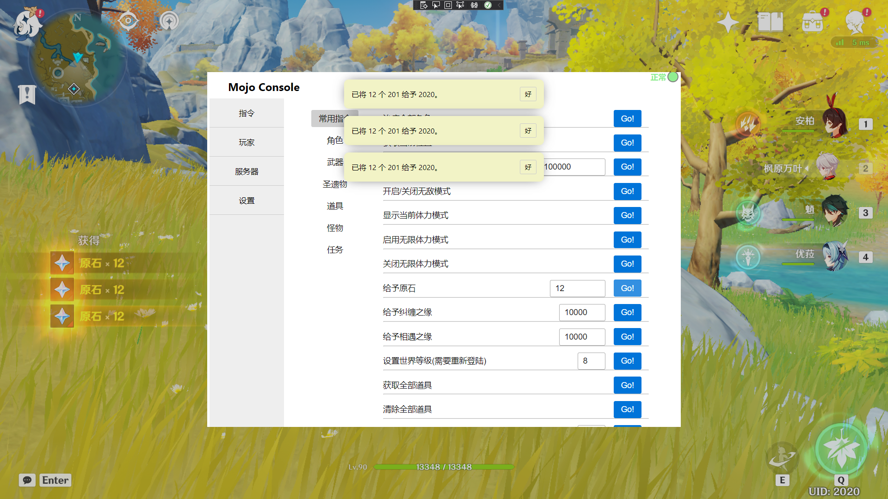

# MojoDesktop


WebView Ver for [Mojo Frontend](https://github.com/SpikeHD/MojoFrontend).

特别感谢：[@mingjun97](https://github.com/mingjun97) 对本项目的支持与帮助！  

------

## Feature

 + 快速打开 MojoFronted （按 T 开启，Esc 关闭） 


## Preview



## 环境要求

 + WebView2
 + .Net Framework 4.8

## 使用方法

  1. 下载解压，并启动一次本程序之后立即关闭
      > **请注意：请至少启动一次本程序之后 才能通过邮件内url直接启动本程序！**
  2. 启动原神 (必须以无边框方式启动）
  3. 把mojoconfig里面的useCDN 改为 true。
  4. 将cdnlink 改为 gccomh://open 
  5. 在游戏内输入指令 /mojo o 
  6. 点击邮件里的链接，如果一切正常，将会弹出一个对话框提示程序已打开
  7. Enjoy it！


## mojoconfig.json 示例
```
{
  "UseCDN": true,
  "CDNLink": "gccomh://open",
  "interfacePath": "/mojoplus/console.html",
  "responseMessage": "[MojoConsole] Link sent to your mailbox, check it!",
  "responseMessageThird": "[MojoConsole] You are trying to obtain link for third-party user, please ask him/her send \"/mojo {{OTP}}\" to server in-game",
  "responseMessageError": "[MojoConsole] Invalid argument.",
  "responseMessageSuccess": "[MojoConsole] Success!",
  "mail": {
    "title": "Mojo Console Link",
    "author": "Mojo Console",
    "content": "Here is your mojo console link: {{ LINK }}\nNote that the link will \u003cb\u003eexpire\u003c/b\u003e in some time, you may retrieve a new one after that.",
    "expireHour": 3
  }
}
```
### 程序获取请到请到 [Realease](https://github.com/SwetyCore/MojoDesktop/releases) 下载最新编译的版本。


